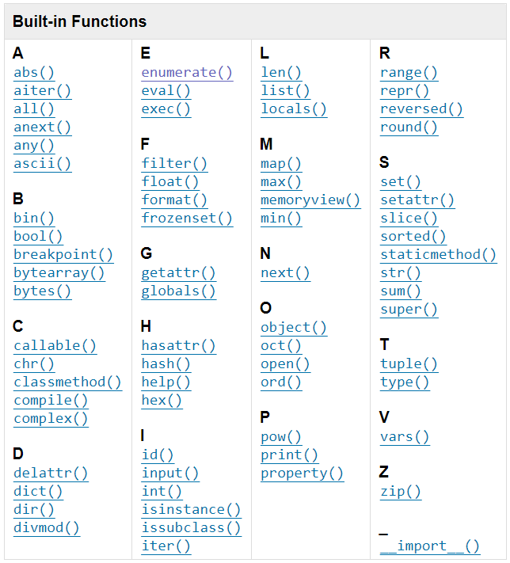

# Built-in Functions
The Python interpreter has a number of functions and types built into it that are always available. They are listed here in alphabetical order.

Ver https://docs.python.org/3/library/functions.html

